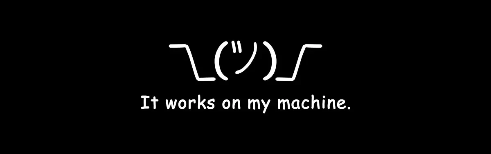

`I orchestrate coding agents and ship the tools they live in.`

---

### 🤖 AI Coding Agents

### 🦀 Languages & Frameworks

### 🛠 Tools

---

### 📌 Featured Projects

| | |
|---|---|
| [**seCall**](https://github.com/hang-in/seCall) `Rust` ⭐357   recall your second brain | [**tunaFlow**](https://github.com/hang-in/tunaFlow) `Rust` ⭐71   One surface for Claude Code, Codex, Gemini & OpenCode |
| [**tunaLlama**](https://github.com/hang-in/tunaLlama) `Python` ⭐39   Use a local LLM from Claude & Codex | [**tunaPi**](https://github.com/hang-in/tunaPi) `Python` ⭐13   Ship code horizontally |

---

  

🔧 Most of these are AI-authored. I design the harness; the agents write the code.

